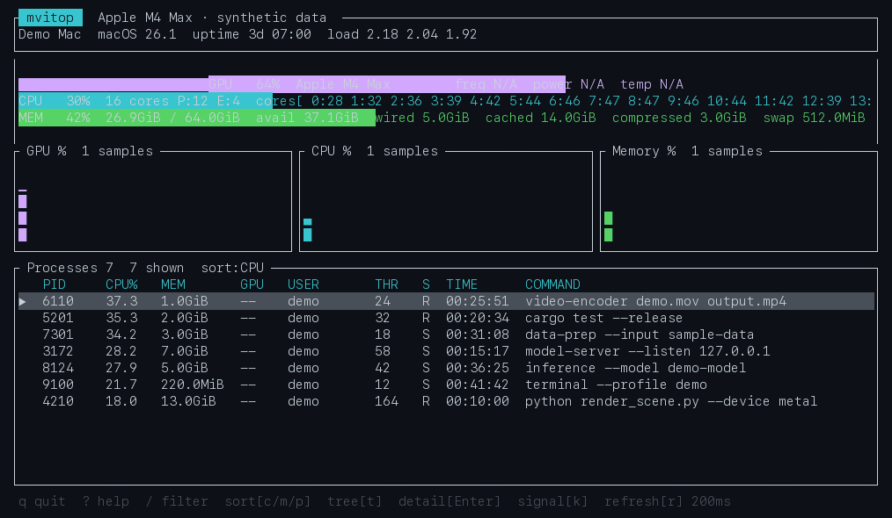

# mvitop

`mvitop` is a fast, keyboard-driven terminal system monitor for Apple Silicon Macs. It reads CPU and unified-memory counters through Mach, system data through sysctl, real GPU utilization from the Apple GPU driver's IORegistry entry, and active GPU process time from a single privileged `powermetrics` stream.


<p align="center">
  
</p>
<p align="center"><sub>Recorded from <code>mvitop --demo</code> with synthetic metrics and jobs. No host or personal data is included.</sub></p>

## Inspiration and acknowledgements

`mvitop` is proudly inspired by [nvtop](https://github.com/Syllo/nvtop) and [nvitop](https://github.com/XuehaiPan/nvitop). Those projects demonstrated how effective a dense, keyboard-first terminal interface can be for understanding GPU activity, resource history, and the processes responsible for a workload.

Their work informs mvitop's product direction: at-a-glance numerical summaries, compact history graphs, responsive terminal layouts, top-style process tables, and keyboard-driven inspection. mvitop applies those ideas to Apple Silicon's different architecture, including a single integrated SoC, unified memory, macOS-native metrics, and a deliberately focused foreground-job view.

The current mvitop implementation was independently authored in Rust with Ratatui, Crossterm, and macOS-native Mach, libproc, sysctl, and IOKit interfaces. mvitop is licensed under GPL-3.0-only so that improvements to the distributed program remain available to its users and contributors. See [ACKNOWLEDGEMENTS.md](ACKNOWLEDGEMENTS.md) for project-specific credits and license notes.

## Features

- Clear CPU utilization, GPU utilization, and unified-memory gauges with current, average, and peak values
- Total and per-core CPU utilization, including P/E core counts when macOS publishes them
- Apple-style unified memory details: used, available, wired, cached, compressed, and swap
- Real Apple GPU device, renderer, and tiler utilization when the driver publishes `PerformanceStatistics`
- A focused job table containing only active foreground commands launched from an interactive terminal
- CPU, GPU time, and unified memory aggregated across each job's child processes
- PID, command, filter, details, marking, and safe signal confirmation for job roots
- Three full-width CPU, GPU, and unified-memory histories with real time axes and peak-preserving compression
- An adaptive job table that exposes `GPU ms/s` and runtime on wide terminals, then removes secondary columns as space narrows
- A job pane that grows with active work and collapses to three rows when no foreground jobs are running
- Full, compact, and minimal layouts selected automatically from the terminal dimensions
- The TUI stays unprivileged; only the fixed `powermetrics` child command runs through `sudo`
- Terminal restoration on normal exit, error, panic, SIGINT, and SIGTERM

## Requirements

- An Apple Silicon Mac
- macOS
- Administrator authorization for per-job GPU time

The prebuilt Homebrew release does not require a Rust toolchain. At launch, mvitop requests administrator authorization before entering the TUI because macOS restricts per-process GPU time. The mvitop UI, filtering, detail view, and signal actions continue to run as the invoking user.

## Install

Homebrew is the recommended installation method:

```sh
brew install kimata1007/tap/mvitop
```

Homebrew will keep the tap and package up to date through the usual commands:

```sh
brew update
brew upgrade mvitop
```

Versioned Apple Silicon archives and SHA-256 checksums are also available from [GitHub Releases](https://github.com/kimata1007/mvitop/releases). Release archives include GitHub artifact attestations that can be verified with:

```sh
gh attestation verify mvitop-v*-aarch64-apple-darwin.tar.gz \
  --repo kimata1007/mvitop
```

## Build from source

Building requires macOS with the Xcode Command Line Tools and Rust 1.85 or newer.

```sh
git clone https://github.com/kimata1007/mvitop.git
cd mvitop
cargo build --release
install -m 755 target/release/mvitop /usr/local/bin/mvitop
```

Run it in an interactive terminal:

```sh
mvitop
```

Before the TUI opens, macOS may ask for your password through `sudo`. mvitop uses the resulting authorization only to run this fixed command:

```sh
/usr/bin/powermetrics --sample-rate 1000 --sample-count -1 \
  --buffer-size 1 --format plist --samplers tasks --show-process-gpu
```

If authorization is declined, CPU, GPU, unified-memory, histories, and the active user-job table remain available. Only the per-job GPU-time column reports `N/A`.

## Keyboard controls

| Key | Action |
|---|---|
| `q` | Quit |
| `?` / `h` | Help |
| `↑`, `↓`, `j` | Select a job |
| `PgUp` / `PgDn` | Move by a page |
| `g` / `p` | Sort by GPU/CPU activity or PID |
| `/` | Edit job filter |
| `Enter` | Job detail |
| `Space` | Mark/unmark a job |
| `k` | Open the signal confirmation menu |
| `r` | Cycle UI refresh through 100/200/500/1000 ms |
| `Esc` | Close a dialog or finish filter editing |

The signal dialog supports SIGTERM, SIGINT, and SIGKILL for the selected job's root process. Before calling `kill(2)`, mvitop reads the target again and compares its start time to guard against PID reuse. PID 1 and mvitop itself are excluded.

## Metric accuracy and macOS limitations

`mvitop` shows missing data as `N/A`; it does not invent or extrapolate unavailable values.

- **GPU utilization:** read from the numeric device, renderer, and tiler utilization values in the Apple GPU driver's IORegistry `PerformanceStatistics` dictionary. These driver-published properties exist on the tested Apple Silicon generations but are not a stable cross-version API contract. Missing renderer or tiler values are simply omitted.
- **Active user jobs:** a job is the foreground process group below an interactive shell. GUI applications, idle shells, background LaunchAgents, other users, root jobs, and mvitop itself are omitted. Commands launched through a terminal, including an IDE's integrated terminal, are supported; IDE Run actions without a terminal and detached jobs are intentionally outside this initial scope.
- **Activity threshold:** a job appears when its descendants use at least 0.1% CPU in the latest one-second interval or report non-zero GPU time. It remains visible for three seconds after activity stops to avoid flicker.
- **Per-job GPU activity:** `gputime_ms_per_s` values from macOS `powermetrics --show-process-gpu` are summed across the job's descendant processes. This option is available only on supported hardware and requires administrator authorization.
- **GPU time vs. GPU utilization:** job GPU time is scheduled time in the one-second measurement window. It is not presented as device utilization, and rows are not expected to add up to the global GPU utilization value.
- **GPU memory:** not shown separately because Apple Silicon uses unified memory and macOS does not publish a reliable per-process GPU allocation through this interface.
- **Memory pressure:** shown as `N/A` because macOS does not expose a stable unprivileged numeric pressure percentage. Used memory follows macOS VM categories instead of pretending to be Linux `MemAvailable`.
- **CPU frequency:** not displayed because the available values are not consistently live or comparable across P/E clusters.
- **Process races:** jobs can start or exit while libproc is being sampled. Missing members are skipped, and PID plus start time identifies a job root across samples.

## Architecture and sampling

The UI performs no metric I/O. Five named workers publish immutable, latest-only snapshots with `ArcSwap`; unchanged job vectors are shared with `Arc` instead of copied on every CPU update. An RCU update prevents simultaneous collectors from overwriting one another. The process worker builds the current user's TTY process tree through libproc, aggregates descendants into foreground jobs, and keeps one `powermetrics` child alive instead of spawning a command every second.

| Collector | Default period |
|---|---:|
| GPU | 350 ms |
| CPU | 500 ms |
| Memory | 500 ms |
| Active user jobs | 1 s |
| Static/slow system data | 15 s |

All histories are bounded ring buffers. Shutdown uses a condition variable so even the 15-second worker exits immediately.

## Performance check

Run the built-in, non-interactive startup check:

```sh
cargo run --release -- --startup-benchmark
```

It reports the first Ratatui frame render, collector-runtime construction, and first CPU/memory snapshot times. Numbers depend on the terminal, build profile, and machine.

## Development

```sh
cargo fmt --all -- --check
cargo clippy --all-targets -- -D warnings
cargo test
cargo build --release
```

The native FFI is intentionally isolated under `src/platform/macos/`. See the safety comments at every unsafe boundary.

## Automated releases

Changes land through normal pull requests using Conventional Commit prefixes such as `feat:`, `fix:`, and `docs:`. After a pull request is merged into `main`, [Release Please](https://github.com/googleapis/release-please-action) creates or updates a release pull request containing the next semantic version, `Cargo.toml`, `Cargo.lock`, and `CHANGELOG.md` changes.

Merging the release pull request creates the version tag and GitHub Release. A separate macOS workflow then verifies the tag against the Cargo package version, runs the full checks, builds and attests the Apple Silicon archive, attaches it to the release, and requests an immediate update from `kimata1007/homebrew-tap`.

Release automation uses two narrowly scoped Actions secrets instead of granting the repository-wide `GITHUB_TOKEN` permission to approve pull requests:

- `RELEASE_PLEASE_TOKEN`: a fine-grained token scoped only to `kimata1007/mvitop`, with Contents, Pull requests, and Issues read/write.
- `HOMEBREW_TAP_TOKEN`: a fine-grained token scoped only to `kimata1007/homebrew-tap`, with Contents read/write for repository dispatch.

If cross-repository dispatch is temporarily unavailable, the tap's scheduled updater checks the latest signed release every six hours and provides an automatic fallback.

## License

Copyright (c) 2026 kimata1007.

`mvitop` is free software licensed under the [GNU General Public License, version 3 only](LICENSE).

Releases through v0.3.0 were published under the MIT License. GPL-3.0-only applies to the current source tree and subsequent releases; it does not revoke permissions already granted for earlier releases.
